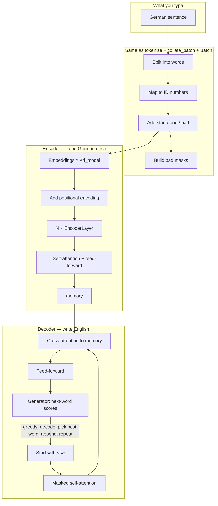

# How a Transformer Turns German into English

This project follows **[The Annotated Transformer](https://nlp.seas.harvard.edu/annotated-transformer/)** (Harvard NLP): the *Attention Is All You Need* model, written in PyTorch, trained as **German → English** on Multi30k.

**You do not need to read the notebook first.** Read this page. Watch the animation. That is the whole machine.

---

## Watch data move (animation)

Open this file in any browser (double-click is enough):

**[docs/transformer-flow.html](docs/transformer-flow.html)**

It auto-plays 12 scenes: sentence → IDs → vectors → encoder memory → decoder word-by-word → training. Pause, go back, or click the list on the right.

GitHub cannot run that animation inside this README. The file in `docs/` is the real movie.



---

## The idea in four sentences

1. A person translating **reads all of the German**, then **writes English one word at a time**, looking back at the German when needed.
2. The **encoder** is the reader. The **decoder** is the writer.
3. **Attention** means: “right now, which words should I look at?”
4. Nothing inside waits like an old RNN. German words can all look at each other at once.

---

## Path of one example

**German:** `Ein rotes Flugzeug fliegt`  
**English we want:** `A red plane flies`

### A. Text → numbers

Computers do not store “Flugzeug” as letters for this model. `tokenize` (spaCy) splits words. `build_vocabulary` / `load_vocab` assign IDs. Unknown words become `<unk>`.

Special tokens (same order as in the notebook):

| Token | Role |
|--------|------|
| `<s>` | Start of sentence |
| `</s>` | End of sentence |
| `<blank>` | Padding so batch rows have equal length |
| `<unk>` | Word not in the vocab |

`collate_batch` builds: `[<s>] + word ids + [</s>]`, then pads on the right to `max_padding` (72 in the translation config).

`Batch` then makes:

- **src_mask** — “this German slot is a real word, not pad”
- **tgt** — English *without* the last token (what the decoder is allowed to see)
- **tgt_y** — English *without* the first token (what it should predict)
- **tgt_mask** — pad **and** future English hidden (`subsequent_mask`)
- **ntokens** — how many non-pad English labels, for averaging loss

That shift is **teacher forcing**: show `<s> A red plane` and ask for `A red plane </s>`.

### B. Numbers → meaning + place

`Embeddings` turns each ID into **512** numbers (the paper’s `d_model`) and scales by √512.

`PositionalEncoding` **adds** (does not concatenate) a sine/cosine pattern for each position so order is not lost. Max length in the buffer is 5000.

Dropout is applied here and in several other places so the model cannot memorize one path.

### C. Encoder (read German)

`Encoder` = `N` copies of `EncoderLayer` (`clones` + `deepcopy` so weights are not shared), then a final `LayerNorm`.

Each `EncoderLayer`:

1. `SubLayerConnection`: pre-norm, **self-attention** (`Q=K=V` = German), residual, dropout  
2. Same wrapper around **position-wise feed-forward**

`attention` is scaled dot-product:  
scores = (Q Kᵀ) / √dₖ → mask pads to a huge negative → softmax → weighted sum of V.

`MultiHeadAttention` splits 512 into **8 heads** of 64, runs attention in each, concatenates, linear projection out. One mask is shared across heads (`unsqueeze` for the head axis).

Feed-forward: 512 → 2048 → 512, ReLU, dropout (`PositionwiseFeedForward`).

After the stack you have **memory**: one 512-vector per German position. `EncoderDecoder.encode` is this whole path. German is encoded **once** per sentence at translation time.

### D. Decoder (write English)

`Decoder` = `N` copies of `DecoderLayer` + final norm.

Each `DecoderLayer` has **three** sublayers:

1. **Masked self-attention** on English so far (`target_mask`)  
2. **Cross-attention**: query = English, key/value = **memory**, `source_mask` = German pads  
3. **Feed-forward** (same style as encoder)

`subsequent_mask` is the causal triangle: position *t* cannot see *t+1, t+2, …*.

`Generator` maps 512 → English vocab size and log-softmax.

### E. Greedy translation

`greedy_decode`:

1. Keep only **one** example (`src[:1]`) — required because decode builds `ys` with batch size 1  
2. `encode` once  
3. Start `ys` at start-id  
4. `decode` with a fresh causal mask  
5. Take the **last** timestep, argmax, append  
6. Repeat up to `max_len`

`translate_german` does string → ids → greedy → words, cut at `</s>`.  
`inference_test` is the same loop on a tiny fake vocab (untrained junk output is expected).  
`check_outputs` / `run_model_example` print source, gold, and model text from the valid loader (`batch_size=1`).

---

## Training path (same model, different schedule)

```
dataloader batch
    → Batch masks
    → EncoderDecoder.forward(src, tgt, src_mask, tgt_mask)
    → hidden states
    → SimpleLossCompute: Generator + LabelSmoothing (KLDiv)
    → backward
    → every accum_iter steps: Adam step, zero grad, LambdaLR with rate()
```

`rate` is the paper’s **Noam** schedule: warmup, then decay like 1/√step. Adam betas (0.9, 0.98), eps 1e-9.

`LabelSmoothing` spreads a little probability to other words so the model is not overconfident (pad row stays zero).

`run_epoch` logs loss and tokens/sec. Eval uses `DummyOptimizer` and `DummyScheduler` so weights do not move. `TrainState` counts steps, samples, tokens.

`train_model` builds `N=6`, runs epochs, saves `{prefix}{epoch}.pt` and `final.pt`.

`make_model` wires encoder, decoder (two attention modules in the decoder layer), two embed+PE stacks, generator, Xavier init on matrices.

---

## Every piece in this notebook (Annotated Transformer map)

Nothing below is a random extra name. If it is in `implementation.ipynb`, it is here.

### Setup

| Name | What it is for |
|------|----------------|
| pip cell | Pin `torch` / `torchtext` so they match |
| Multi30k URL/MD5 patch | Official Harvard fix for broken dataset links |
| `clear_multi30k_cache` | Delete corrupt torchtext cache |
| `BOS_TOKEN` … `SPECIALS` | `<s> </s> <blank> <unk>` |

### Architecture (paper figure)

| Name | What it is for |
|------|----------------|
| `clones` | N independent copies of a layer |
| `LayerNorm` | Stabilize each token’s 512-vector |
| `SubLayerConnection` | Pre-norm + dropout + residual |
| `attention` | Scaled dot-product attention |
| `MultiHeadAttention` | 8 heads, Q/K/V/O linears |
| `PositionwiseFeedForward` | MLP on every position |
| `EncoderLayer` | Self-attn + FFN |
| `Encoder` | Stack + final norm |
| `DecoderLayer` | Masked self + cross + FFN |
| `Decoder` | Stack + final norm |
| `Embeddings` | ID → vector × √d |
| `PositionalEncoding` | Add sinusoids |
| `Generator` | Hidden → log-probs over English |
| `EncoderDecoder` | `encode` / `decode` / `forward` |
| `make_model` | Build the full net |

### Masks and first inference

| Name | What it is for |
|------|----------------|
| `subsequent_mask` | Causal triangle |
| `inference_test` | Smoke test decode on dummy ids |

### Data

| Name | What it is for |
|------|----------------|
| `tokenize` / `load_tokenizers` | spaCy DE/EN |
| `_multi30k_corpus` | Train+valid (+test if it loads) |
| `yield_tokens` | Feed vocab builder |
| `build_vocabulary` / `load_vocab` | min_freq=2, save `vocab.pt` |
| `collate_batch` | BOS/EOS/pad/stack |
| `create_dataloaders` | Multi30k DataLoaders |

### Training utilities

| Name | What it is for |
|------|----------------|
| `Batch` | Tensors + masks + ntokens |
| `LabelSmoothing` | Soft targets + KLDiv |
| `SimpleLossCompute` | Generator + criterion / ntokens |
| `TrainState` | Counters |
| `DummyOptimizer` / `DummyScheduler` | Eval no-ops |
| `rate` | Noam learning rate |
| `run_epoch` | One pass, accum, log |
| `train_model` | Full train/valid loop |

### Translation

| Name | What it is for |
|------|----------------|
| `greedy_decode` | Autoregressive argmax |
| `translate_german` | String in, string out |
| `check_outputs` | Print examples |
| `run_model_example` | Load vocab, batch_size=1, optional weights |

`DDP` is **imported** (Harvard multi-GPU). This notebook’s `train_model` is **single device**. There is no Altair attention-plot cell, no GPUtil, no BPE, no beam search, no checkpoint averaging — those are extra sections in the original blog, not this file.

---

## Shapes (intuition only)

For one padded sentence of length 72, `d_model=512`, 8 heads:

- IDs: 72 numbers  
- After embed: 72 × 512  
- One head: 72 × 64  
- Memory: 72 × 512  
- While decoding after 3 English words: decoder sees length 3, still reads memory of length 72  

---

## Files

| File | Role |
|------|------|
| [implementation.ipynb](implementation.ipynb) | Full Annotated Transformer implementation |
| [docs/transformer-flow.html](docs/transformer-flow.html) | **Animated** data path |
| `vocab.pt` | Saved German/English vocab if you built it |
| This README | The story in English |

Run the notebook **top to bottom**. Restarting the kernel means run every cell again. An untrained model will not produce real English; that is normal. Uncomment the training config at the bottom for a long GPU run (`N=6`, 8 epochs).

---

## Remember

**Encoder** fills a German memory. **Decoder** writes English, looking at that memory, never at future English. **Attention** is the looking. Everything else (norm, residual, PE, FFN, masks, smoothed loss, warmup lr) exists so that looking can be trained stably.
