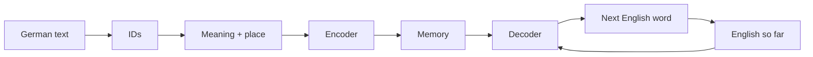
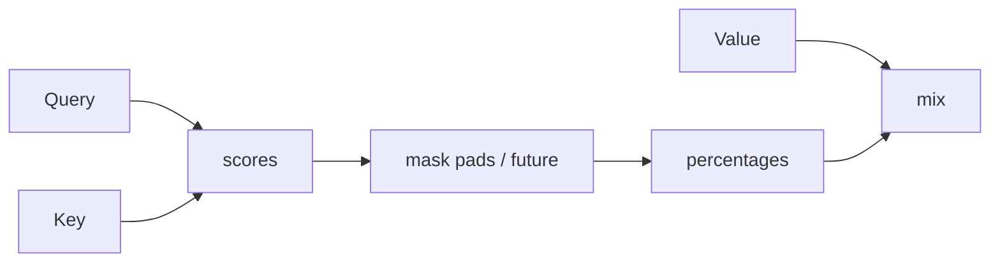

# Illustrated Transformer (no notebook needed)

This repo is **The Annotated Transformer** in PyTorch: German → English.

**How to use this page:** scroll. Every block in `implementation.ipynb` has a **picture** and a short “what you are seeing.” You do not need to open the code.

**Moving pictures (browser):**

| File | What it shows |
|------|----------------|
| [View Animation →](https://raw.githubusercontent.com/sreekanthTa/TransformersArch/master/docs/transformer-flow.html) | Data walking through the whole model (auto-play) |
| [View Blocks →](https://raw.githubusercontent.com/sreekanthTa/TransformersArch/master/docs/illustrated-blocks.html) | One animated card per notebook function |

---

## The whole factory (what data does)

```text
  YOU TYPE GERMAN                    MODEL WRITES ENGLISH
  "Ein rotes Flugzeug"               "<s> A red plane … </s>"
           │                                    ▲
           ▼                                    │
     cut into words                        pick next word
           │                                    │
           ▼                                    │
     replace words by numbers                   │
           │                                    │
           ▼                                    │
     512 numbers per word  (meaning)            │
     + a stamp for 1st / 2nd / 3rd place        │
           │                                    │
           ▼                                    │
     ENCODER: German words look at              │
     each other  (6 floors)                     │
           │                                    │
           ▼                                    │
     MEMORY  =  "I understood the German"  ─────┘
                  DECODER looks here
                  while writing, one English
                  word at a time
```



---

## Picture atlas — every notebook piece

Same order as the Annotated Transformer notebook.

---

### Special tokens

```text
  <s>        door opens     “start writing / start of sentence”
  </s>       door closes    “the sentence is finished”
  <blank>    empty chair    padding so rows in a batch are equally long
  <unk>      mystery word   not in the dictionary
```

`collate_batch` always does: **start + words + end**, then fills empty chairs on the right.

---

### `clear_multi30k_cache`

```text
  [broken download folder]  ──delete──►  empty
  Next run can download Multi30k again.
```

Only if the dataset cache is corrupt.

---

### `tokenize` / `load_tokenizers`

```text
  "Ein rotes Flugzeug"
           │  spaCy German
           ▼
  Ein | rotes | Flugzeug
```

English sentences use the English spaCy model. That is all tokenization is.

---

### `clones`

```text
  one layer template
        │
        ├── copy 1  (own weights)
        ├── copy 2
        └── copy N     paper uses N = 6
```

If you reused the *same* layer six times, all floors would share one brain. `deepcopy` gives six separate brains.

---

### `LayerNorm`

```text
  one word’s 512 numbers:   ■■■■■ noisy mix
           │  subtract average, divide by spread
           ▼
  same 512 numbers:         ▬▬▬▬▬ calmer, comparable
           │  learnable stretch + shift
           ▼
  ready for the next block
```

It is **per word**, not per batch. Stops values from exploding or dying.

---

### `SubLayerConnection` (residual + dropout)

```text
  incoming ──────────────────────────────────┐
       │                                     │  ADD
       ▼                                     │
    LayerNorm                                │
       │                                     │
       ▼                                     │
    the real work (attention or FFN)         │
       │                                     │
    dropout (randomly drop some signals)     │
       │                                     │
       ▼                                     ▼
              outgoing = old + new
```

You always keep a copy of the old signal. That is why a 6-floor tower can still train.

---

### `attention` (the heart)

```text
  Query  = “what am I looking for?”
  Key    = “what do I offer?”
  Value  = “what content do I give you?”

  For every pair (me, them):
      score = how well Query matches Key
      divide by √64 so scores are not huge
      if mask says 0: score → “ignore me”
      softmax: turn scores into % that add to 100%
      output = mix of Values using those %
```



---

### `MultiHeadAttention`

```text
  512 numbers
       │ split into 8 views of 64
       ▼
  head1  head2  head3  …  head8     (8 ways of looking at once)
       │ glue back to 512
       ▼
  one linear mix  →  still 512
```

Encoder self-attention: Q, K, V all from German.  
Decoder self-attention: all from English so far.  
Cross-attention: Q from English, K and V from **memory**.

---

### `PositionwiseFeedForward`

```text
  each word, alone (same recipe for every position)

  512  ──widen──►  2048  ──ReLU──►  ──narrow──►  512
```

Attention mixes **words**. This MLP rethinks **one** word.

---

### `EncoderLayer`

```text
  German vectors
       │
       ▼
  [norm → self-attention → drop] + skip
       │
       ▼
  [norm → feed-forward → drop] + skip
```

---

### `Encoder`

```text
  floor 1  EncoderLayer
  floor 2  EncoderLayer
  …
  floor 6  EncoderLayer
       │
       ▼
  extra LayerNorm
       │
       ▼
  MEMORY   (German, fully mixed)
```

`EncoderDecoder.encode` = embeddings + positions + this stack.

---

### `DecoderLayer`

```text
  English so far
       │
       ▼
  1. Masked self-attention     (only past English)
       │
       ▼
  2. Cross-attention           (look at MEMORY / German)
       │
       ▼
  3. Feed-forward
```

---

### `Decoder`

```text
  same 3-step floor, repeated N times, then LayerNorm
```

`EncoderDecoder.decode` = English embeddings + positions + this stack.

---

### `Embeddings`

```text
  id 47  →  lookup row 47  →  512 numbers  →  multiply by √512
```

German table and English table are **different**.

---

### `PositionalEncoding`

```text
  place 1:  gentle wave pattern
  place 2:  a bit shifted
  place 3:  …

  meaning vector  +  wave  =  still 512 numbers
              (add, do not glue extra length)
```

Without this, “red plane” and “plane red” look the same to attention.

---

### `Generator`

```text
  512 numbers for one position
       │  big linear layer
       ▼
  one score per English word in the vocab
       │  log-softmax
       ▼
  “how likely is each next word?”
```

---

### `EncoderDecoder`

```text
  TRAIN (all at once):
    encode(German) → memory
    decode(English prefix, memory) → hidden states

  TRANSLATE:
    encode(German) once
    decode again and again, growing English
```

---

### `make_model`

```text
  New attention brick, new FFN brick, new PE brick
       │  deepcopy into encoder floors, decoder floors
       ▼
  Encoder stack + Decoder stack
  + German embed+PE
  + English embed+PE
  + Generator
       │  Xavier init on matrices
       ▼
  Ready network  (paper: N=6, d=512, ff=2048, heads=8)
```

---

### `subsequent_mask` (no future)

```text
         word0  word1  word2  word3
  word0    ✓      ·      ·      ·
  word1    ✓      ✓      ·      ·
  word2    ✓      ✓      ✓      ·
  word3    ✓      ✓      ✓      ✓
```

Dots are forbidden. Training cannot cheat by reading the answer ahead.

---

### `inference_test`

Tiny fake vocab, untrained weights, same encode/decode loop as real translation. Output will look like random ids. That is a **shape test**, not a translator.

---

### `Batch`

```text
  full English:   <s>  A   red  plane  </s>
  decoder sees:   <s>  A   red  plane
  must predict:        A   red  plane  </s>
```

Plus masks: ignore pads; ignore future.

---

### Vocabulary helpers

```text
  many German captions  →  count words  →  keep if seen ≥ 2 times
  save as vocab.pt

  yield_tokens     walks the corpus
  build_vocabulary builds both languages
  load_vocab       loads file or builds once
  _multi30k_corpus train + valid (+ test if it loads)
```

---

### `collate_batch` / `create_dataloaders`

```text
  several sentence pairs
       │  tokenize, ids, <s> </s>, pad to 72
       ▼
  two grids of numbers:  German batch  |  English batch
```

`create_dataloaders` wraps Multi30k. Translation demos use **batch size 1**.

---

### `LabelSmoothing`

```text
  instead of 100% on the true word:

  true word  ~ 90%
  all others share ~10%
  pad stays 0
```

Stops the model from being arrogantly sure.

---

### `SimpleLossCompute`

```text
  hidden states → Generator → compare to smoothed labels → loss
  divide by number of real (non-pad) tokens
```

---

### `rate` (learning-rate schedule)

```text
  steps →
  lr slowly UP during warmup (e.g. 3000)
       then DOWN like 1 / sqrt(step)
```

Paper name: Noam schedule. Used with Adam.

---

### `run_epoch` / `TrainState` / dummies

```text
  for each batch:
      forward → loss → backward
      every few batches: update weights  (accumulation)
      log loss and speed

  eval: DummyOptimizer / DummyScheduler  (look, don’t touch)
  TrainState: how many steps / sentences / tokens
```

---

### `train_model`

```text
  make N=6 model
  for each epoch: train run_epoch → save → valid run_epoch
  save final.pt
```

---

### `greedy_decode`

```text
  memory = encode(German)          ← once
  english = [ <s> ]
  loop:
      look at english + memory
      take the LAST position
      pick the highest-scoring word
      append it
```

Always **one sentence** at a time (slice batch to 1).

---

### `translate_german` / `check_outputs` / `run_model_example`

```text
  string → ids → greedy_decode → words → cut at </s>

  check_outputs: print German, gold English, model English
  run_model_example: load vocab, tiny N=2 smoke model, optional weights
```

---

## What this notebook does *not* include

The Harvard **blog** also shows attention heatmaps (Altair), GPU monitors, multi-GPU DDP training, BPE, beam search, averaging checkpoints. Those are not cells here. `DDP` is only imported.

---

## Files

- `implementation.ipynb` — the running code  
- `docs/transformer-flow.html` — movie of the pipeline  
- `docs/illustrated-blocks.html` — one card per block  
- `vocab.pt` — saved dictionaries after you build them  

Run the notebook top to bottom only when you want it to execute. This README is the illustrated course.
